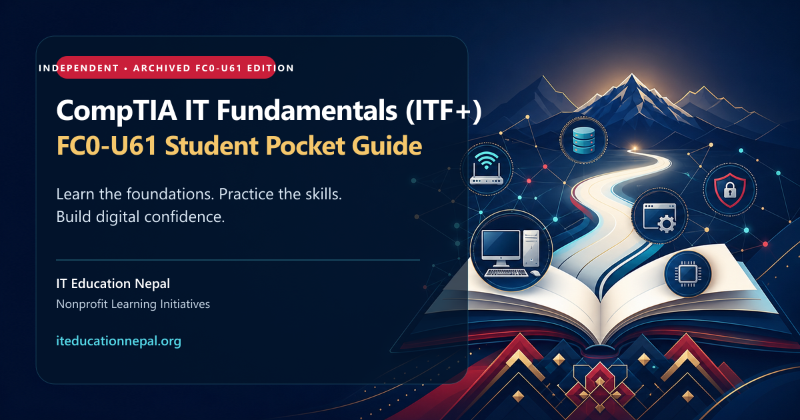
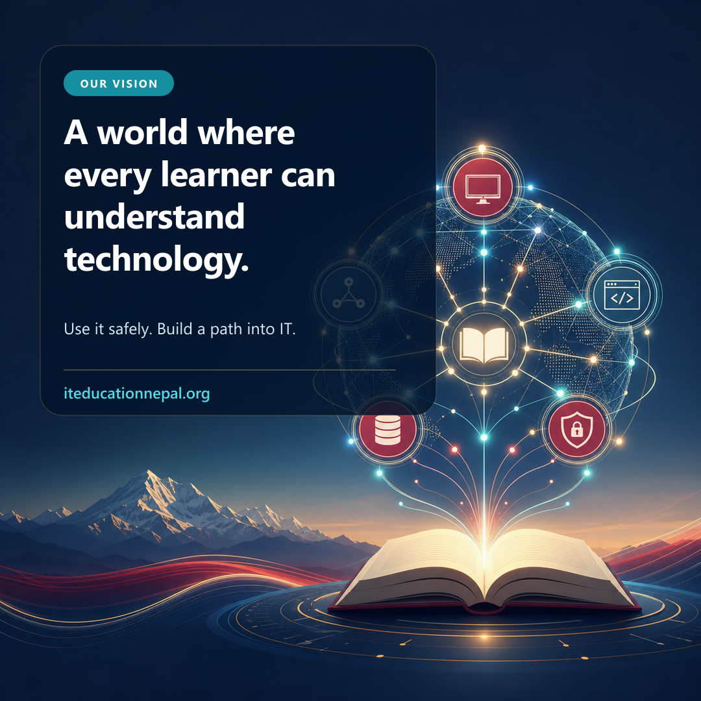

<!-- Place this hero directly below the main README title. -->

## Our mission and vision

  
  

The **CompTIA IT Fundamentals (ITF+) FC0-U61 Student Pocket Guide** supports this mission with clear explanations, practical labs, review questions, and structured coverage of the archived FC0-U61 objectives.
